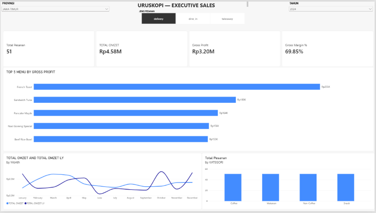

# URUSKOPI — Executive Sales Dashboard

Power BI dashboard untuk menganalisis performa penjualan dan profitabilitas SEDUKOPI.

## 📊 Project Overview

Project ini merupakan dashboard analisis penjualan yang dibuat menggunakan Microsoft Power BI.

Dashboard digunakan untuk memantau beberapa indikator utama:

- Total Pesanan
- Total Omzet
- Gross Profit
- Gross Margin
- Performa menu
- Tren omzet bulanan
- Performa pesanan berdasarkan kategori

## 🎯 Business Objective

Dashboard ini dibuat untuk membantu memahami performa penjualan URUSKOPI melalui analisis:

- Perkembangan omzet dari waktu ke waktu
- Profitabilitas penjualan
- Menu dengan kontribusi gross profit terbesar
- Distribusi pesanan berdasarkan kategori
- Perbandingan omzet dengan periode sebelumnya

## 🛠️ Tools

- Microsoft Power BI
- Power Query
- DAX
- Microsoft Excel

## 🧮 DAX Measures

### TOTAL OMZET
``DAX
TOTAL OMZET = SUM(pesanan4[JUMLAH HARGA])

### TOTAL PESANAN 
``DAX
Total Pesanan = 
DISTINCTCOUNT('pesanan4'[ID PESANAN])

### Gross Profit
``DAX
Gross Profit = 
SUM(detail_order3[SUB TOTAL]) - [TOTAL HPP]

### Gross Margin %
``DAX
Gross Margin % = 
DIVIDE(
    [Gross Profit],
    [Total Omzet],
    0
)
### Achievement

``DAX
Achievement = 
DIVIDE([TOTAL OMZET], [Target Bulanan])

### TOTAL OMZET LY
``DAX 
TOTAL OMZET LY = CALCULATE([TOTAL OMZET],SAMEPERIODLASTYEAR(pesanan4[TANGGAL PESANAN].[Date]))
### TOTAL HPP
``DAX
TOTAL HPP = SUMX(detail_order3,detail_order3[JUMLAH]* RELATED(item_menu2[HARGA POKOK]))

## 🧹 Data Preparation

Data diproses menggunakan Power Query sebelum digunakan dalam dashboard.

Tahapan yang dilakukan meliputi:

- Memeriksa kualitas data
- Membersihkan data kosong
- Memperbaiki tipe data
- Memastikan format tanggal sesuai
- Membersihkan data transaksi
- Melakukan transformasi data yang diperlukan
- Menyiapkan data untuk analisis di Power BI

## 📈 Dashboard

Dashboard utama menampilkan KPI dan visualisasi untuk membantu analisis performa penjualan URUSKOPI.

## 🔎 Key Analysis

### 1. Sales Performance

Menganalisis total pesanan dan total omzet untuk melihat performa penjualan.

### 2. Profitability

Menganalisis gross profit dan gross margin untuk memahami tingkat profitabilitas.

### 3. Product Performance

Mengidentifikasi Top 5 menu berdasarkan gross profit.

### 4. Sales Trend

Menganalisis perkembangan omzet bulanan dan membandingkannya dengan periode sebelumnya.

### 5. Category Analysis

Membandingkan jumlah pesanan berdasarkan kategori produk.

## 💡 Key Insights

Insight dari hasil analisis akan digunakan untuk memahami:

- Produk dengan kontribusi gross profit tinggi
- Perubahan performa omzet antarbulan
- Kategori dengan jumlah pesanan yang berbeda
- Kondisi profitabilitas secara keseluruhan

## 👤 Author

**MUHAMMAD AS'AD DIFINUBUN**

Power BI Data Analytics Portfolio
